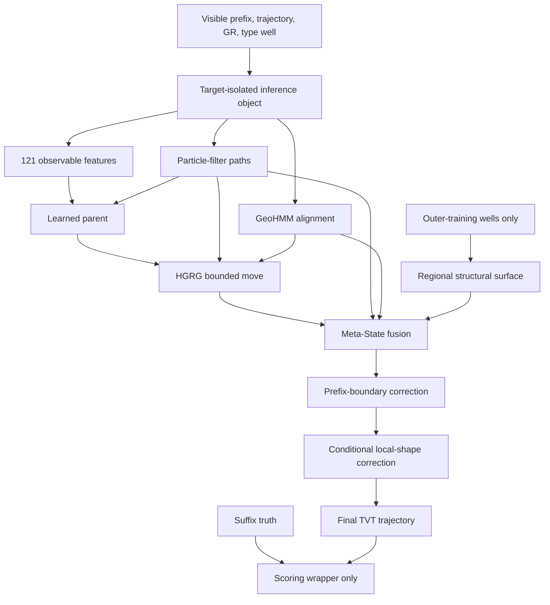
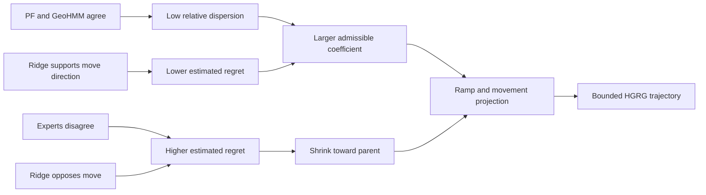
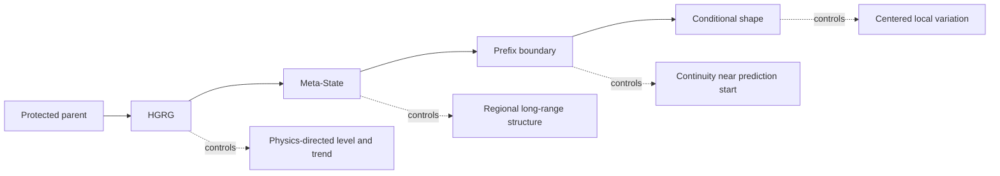
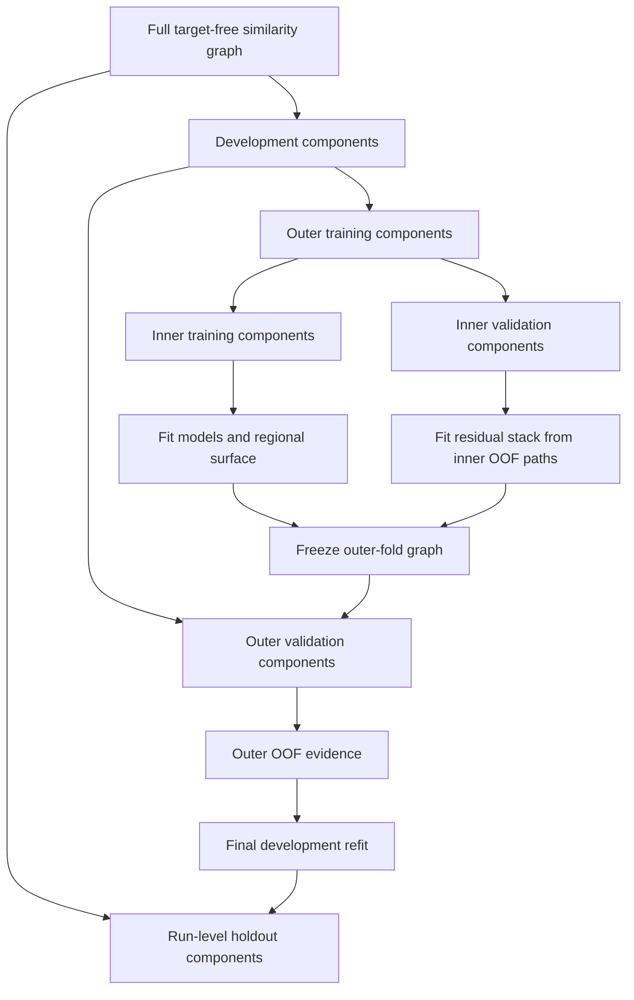
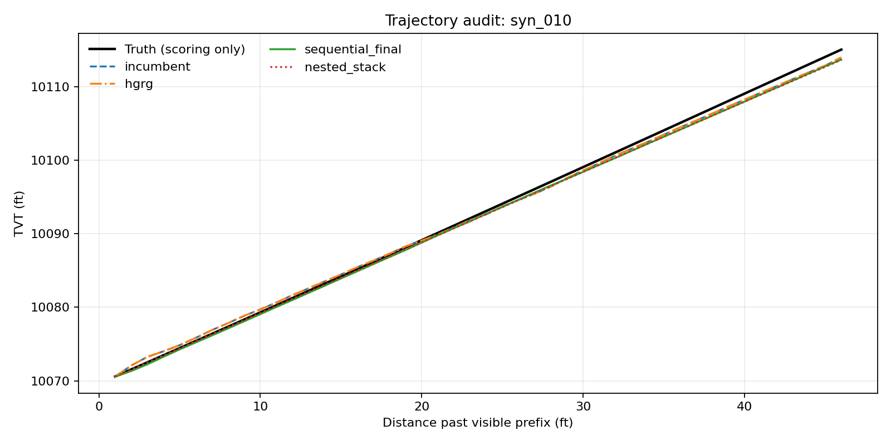

# Methodology deep dive

## Overview

The pipeline reconstructs one TVT trajectory per well. A learned parent
provides the starting path. PF and GeoHMM propose an alignment, HGRG decides
how much of that move to accept, and Meta-State adds regional structure. Two
small overlays handle the prefix boundary and local shape.

One rule runs through all of it: no stage may replace its predecessor. Each
stage may only propose a bounded move away from the path it was handed, and
every move has a budget. The reason is that a wrong geological alignment is not
a slightly worse prediction but a well path in the wrong place, and an expert
confident enough to produce one is exactly the expert that should not be
trusted with unlimited authority.

The same geological component graph governs folds, holdout assignment, and
bootstrap sampling. Suffix truth never leaves the scoring wrapper.

## 1. Path reconstruction

The observed borehole geometry describes where the drill bit traveled, while
TVT describes position in a geological column. These coordinates are related
but not interchangeable. The same gamma-ray pattern may occur at several
depths, and local faults or dip changes can make a visually convincing match
geologically wrong.

I use the structural coordinate

$$
U(s) = TVT(s) + Z(s),
$$

where $s$ is measured depth. The known borehole motion $Z(s)$ is removed when
reasoning about the latent geological surface and restored at the end:

$$
TVT(s) = U(s) - Z(s).
$$

This coordinate separates borehole motion from geological motion. A well may
move vertically while following a relatively smooth geological surface, so a
smoothness assumption is easier to state in $U$ than in TVT.

### Figure 1. Information flow through the final sequential path



Suffix truth is passed to the scorer only. It never enters the feature builder,
particle filter, GeoHMM, structural surface, or overlays.

## 2. Protected-parent inference

A stable parent anchors every update. The physics models propose a direction
and the gate sets the movement size.

The clean-room parent begins with a fixed Ridge and particle-filter blend. A
nonlinear residual model receives only a very small effective weight and is
disabled when its disagreement with the parent becomes excessive. Each later
stage receives the preceding stage as a protected reference.

```text
parent
  + admissible HGRG move
  + admissible regional move
  + admissible boundary move
  + admissible centered shape move
= final trajectory
```

An unstable expert can still contribute a direction without controlling the
full prediction. Each stage also has a clear fallback: its input path is used
unchanged when the stage abstains.

## 3. Particle filtering represents local alignment uncertainty

The particle filter tracks a structural position and local rate. For particle
$j$ at suffix row $t$,

$$
r_t^{(j)} = 0.998r_{t-1}^{(j)} + \eta_t^{(j)},
$$

$$
U_t^{(j)} = U_{t-1}^{(j)} + r_t^{(j)}\Delta MD_t + \epsilon_t^{(j)}.
$$

The implied TVT particle is $U_t^{(j)}-Z_t$. Its expected gamma ray is read
from the type-well curve, and the observed mismatch determines the likelihood:

$$
\ell_t^{(j)} \propto
\exp\left[-\frac{1}{2}
\left(\frac{GR_t-GR_{TW}(TVT_t^{(j)})}{\sigma_{GR}}\right)^2\right].
$$

The noise scale is estimated from the visible prefix and clipped to a plausible
range. Systematic resampling occurs when effective particle count falls below
half of the ensemble.

Several random seeds produce separate trajectory hypotheses. The final PF path
uses predictive evidence to weight seeds, with an effective-sample-size floor
that prevents one Monte Carlo realization from dominating too easily. The
code also contains prequential aggregation controls where row $t$ uses only
evidence available before row $t$. Those controls make the temporal information
contract auditable.

The particle filter works best near the visible anchor and when the gamma-ray
likelihood has one dominant mode. Repeated motifs can support several paths,
so the PF is kept as one expert in the pipeline.

## 4. GeoHMM alignment

GeoHMM discretizes TVT and local slope. A state can be written as

$$
x_t = (v_t, m_t),
$$

where $v_t$ is a TVT-grid location and $m_t$ is one of 25 slope states. The
emission score compares the observed horizontal-well gamma ray with the
type-well gamma ray at $v_t$. Robust clipping and a likelihood floor prevent a
single extreme log value from eliminating every plausible state.

The transition model favors continuity in both TVT and slope. Forward and
backward recursions then use evidence on both sides of a suffix location. The
implementation stores checkpoints instead of every full state table, reducing
memory without changing the state model.

PF and GeoHMM use the same local data but fail in different ways. PF carries
continuous Monte Carlo hypotheses forward from the heel. GeoHMM searches a
discrete alignment surface and applies backward smoothing. Their disagreement
is used later by HGRG as a risk feature.

## 5. HGRG

The Hierarchical Geology Regret Gate is the main project-specific algorithm.
It first creates a physics bridge

$$
Q = PF + \beta(HMM-PF)
$$

and proposes the move

$$
d = Q-B,
$$

where $B$ is the protected parent. Two target-free quantities control trust.

The first is relative expert dispersion:

$$
u = \frac{RMS(HMM-PF)}{\max(RMS(d),\varepsilon)}.
$$

Large $u$ means the two physics experts disagree strongly relative to the size
of the proposed parent move.

The second is directional support from Ridge:

$$
p = \frac{d^\top(Ridge-B)}
{\max(d^\top d,\varepsilon)}.
$$

Positive $p$ means Ridge points in the same direction as the physics bridge.
This provides an independent directional check and lowers the estimated risk:

$$
risk = u\exp[-\kappa\,clip(p,-1,1)].
$$

Risk is converted to a monotone gate with a nonzero shrink floor. The final
coefficient also obeys a well-level RMS budget:

$$
a = gate\cdot\min\left(a_{max},
\frac{b_{RMS}}{\max(RMS(d),\varepsilon)}\right).
$$

The move ramps in over the first 250 ft and is clipped per row:

$$
\widehat y_{HGRG} = B + clip\left[
clip(h/250,0,1)\,a\,d,
-b_{row},b_{row}\right].
$$

### Figure 2. HGRG decision logic



HGRG uses the gate to size the proposed move.

## 6. Regional Meta-State

HGRG is target-local. Meta-State adds a regional observation fitted only on
outer-training wells. A radial basis function surface predicts structural
level from well coordinates. The target's visible prefix then supplies a local
offset, so the regional model contributes shape and trend without controlling
the target datum directly.

The three observations are PF, GeoHMM, and the regional structural path. Their
weights come from correlated generalized least squares:

$$
w = \frac{\Sigma^{-1}\mathbf 1}
{\mathbf 1^\top\Sigma^{-1}\mathbf 1}.
$$

$\Sigma$ contains explicit PF/HMM and structural correlations. Prefix
rolling-origin error increases the regional expert's variance when it
transfers poorly to the visible part of the target well.

The fused observation is smoothed with a constant-acceleration state:

$$
x_t = [U_t,\dot U_t,\ddot U_t]^\top.
$$

A Kalman forward pass estimates the online state, and a Rauch-Tung-Striebel
backward pass produces a coherent trajectory. Meta-State updates the HGRG path
under a 5-ft well RMS budget and a 10-ft row cap.

The regional model is therefore fitted on training geology, calibrated with
the target's visible prefix, and bounded again at deployment.

## 7. Separate datum, boundary, and shape corrections

One unconstrained residual model can mix several physically different errors.
This pipeline separates them.

### Prefix-boundary continuity

The last visible part of $U=TVT+Z$ supplies a robust one-sided tangent. Its
suffix continuation is

$$
U_{tan}(h)=U_0+\widehat m h.
$$

The boundary correction compares this tangent with the current structural
path and decays exponentially:

$$
\Delta_{boundary}(h)=
\exp(-h/\tau)\,[U_{tan}(h)-U_{base}(h)].
$$

The correction is strongest at the hand-off and fades as the model reaches
parts of the well where a constant tangent is less credible.

### Conditional local shape

The shape branch starts from the stride-6 disagreement

$$
r(h)=HMM(h)-PF(h)
$$

and removes its within-well mean:

$$
r_c(h)=r(h)-\overline r.
$$

Mean removal limits this branch to local shape before projection. A gate then
combines amplitude and normalized slope information, followed by a 0.75-ft RMS
budget and a 2.5-ft row cap.

### Figure 3. Each correction owns one geometric role



## 8. Geological component validation

Rows from one well are not independent, and nearby wells can share structural
information. A simple well split can therefore remain optimistic.

The graph uses only inference-time information. Each well is summarized by
median XY location, a 64-point normalized target-GR fingerprint, and a 64-point
type-well fingerprint. Two wells are connected if either condition holds:

1. their spatial distance is below the local radius;
2. their distance is below the wider similarity radius and either GR
   fingerprint correlation exceeds the frozen threshold.

Connected components are indivisible split units. Whole components enter the
run-level holdout, outer folds, inner folds, and bootstrap resampling.

### Figure 4. Nested component validation



The stack is fitted from inner out-of-fold predictions and scored on different
components. Target-free PF, GeoHMM, and feature caches can be reused, while
learned models and regional surfaces are refitted for each fold.

## 9. Validation results

The clean-room sequential path was evaluated on two non-overlapping halves of
the 320-well component universe. Across 1,556,878 scored rows, it improved the
incumbent in all ten saved outer folds. Primary160 outer OOF improved from
15.5551 to 14.8993 RMSE, and Complement160 outer OOF improved from 13.5177 to
12.6000 RMSE.

The improvement has the same sign in both panels and all ten folds. However,
the sequential path still harmed 19.5% to 28.1% of wells depending on the
contract. Worst-10% component CVaR also increased slightly on the Complement
holdout while pooled RMSE improved.

For this reason, promotion uses pooled row RMSE together with macro-well and
macro-component error, fold signs, harmed-well rate, horizon behavior, and
worst-component tail risk.

## 10. How to read the trajectory figure



The black curve is suffix truth and exists only for scoring. The other curves
show the path after each bounded stage.

1. **Boundary behavior:** check for an abrupt jump at the first hidden row.
2. **Long-range drift:** check whether the candidate follows the broad trend
   without accumulating a large datum error.
3. **Local shape:** check whether small variations improve alignment without
   adding high-frequency oscillation.

The example comes from the deterministic smoke reproduction. Real-data results
are reported in `REALDATA_NESTED_RESULTS.md`.

## 11. Negative results

Several plausible extensions were not promoted:

- a directional structural field reversed on frozen transfer;
- an expressive regret router could not reliably choose the correct expert;
- a Ridge-heavy stack produced severe tail failures despite attractive
  averages;
- a four-mode switching-state model was worse on both Primary160 OOF and its
  run-level holdout;
- group-robust fusion transferred asymmetrically between panels;
- a 5% Ridge trust-region move remains post-hoc because both panels had already
  been inspected.

All six are disabled in the default configuration.

## 12. Limitations and next experiments

Four things this work does not establish, stated plainly so they are not read
into it. It gives no calibrated geological uncertainty: the PF and GeoHMM
spreads are disagreement measures and nothing more. It makes no causal claim.
It does not reproduce the historical submission exactly. And because all four
robustness contracts were run from a single training seed, the component
bootstrap measures which geology was sampled, not whether a refit would land in
the same place.

The regional surface carries a fifth, quieter risk: it depends on coordinate
semantics that the source data never document.

Where I would go next, in order of value:

1. register at least three independent refits under one frozen component split;
2. estimate expert second moments inside inner folds before enabling empirical
   constrained GLS;
3. predeclare a leave-region-out or externally defined type-well-family test;
4. calibrate predictive intervals at the component level;
5. require pooled and macro-component improvement without a material CVaR
   regression.
